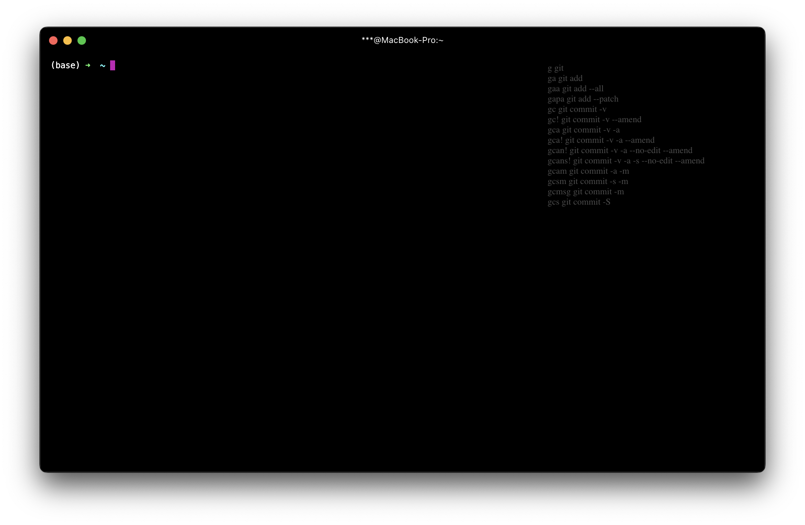

# Hyper Tips

> Your transparent cheat-sheet with favourite commands



## Configuring plugins

Modify your `~/.hyper.js` file to configure the plugin:

- opacity - change opacity of tips (default 0.3)
- path - path to the file with content you need for tips (default ~/.hyper-tips)
- toggleKey - key (combination) to show/hide tips (default cmd+alt+t)

```js
config: {                                                                      
  tips: {                                                                 
    opacity: "0.3",
    path: "/home/devel/.hyper-tips",
    toggleKey: "cmd+alt+t"                                                                        
  },
}
```
